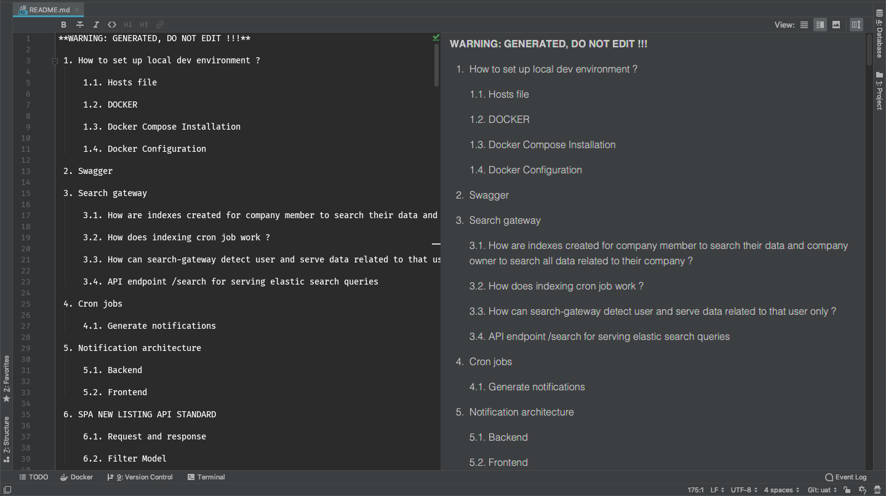

Collect docs from code
======================

Collect documentations from code and create a readme file

Motivation
==========

I usually write a lots of explainatory comments in source code, but after finishing a project, 
I should create a readme file for components, packages, modules that I have implemented. 
At this time, I need to choose:
- if I should copy all source code comments to the readme file and then delete these comments
- or if I should write a new readme and still keep all source code comments
- or not write a readme at all
So, my final solution is to write a tools to collect all source code comments and put everything into a readme file.

How it work
===========

The script will parse source code files utilizing a sophisticated pattern matching algorithm 
and create an abstract syntax tree.

Then the useful info will be extracted from abstract syntax tree and sorted in ascending order
to create the readme indexes and detail.

Example
=======

Eaxmple code:

```
package main

import collectdocsfromcode "github.com/phannam1412/collect-docs-from-code"

func main() {
	basePath := "<your project root directory>"
	paths := []string{
		basePath + "/src",
		basePath + "/dev",
		basePath + "/index.php",
	}
	extensions := []string{"php", "go"}
	writeResultTo := basePath + "README.md"
	collectdocsfromcode.Run(paths, extensions, writeResultTo)
}
```

### There are some comments in source code like this: 


### Output after scanning all source codes to create readme index and detail:

Index:



Detail:


Example code:

Reference
=========

- [Extended Backus–Naur form](https://en.wikipedia.org/wiki/Extended_Backus%E2%80%93Naur_form)

- [Pattern matching implementation](https://github.com/phannam1412/go-pattern-matching)
